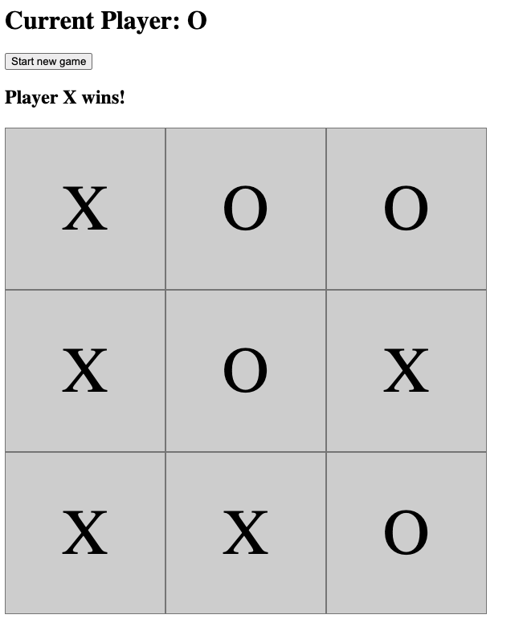
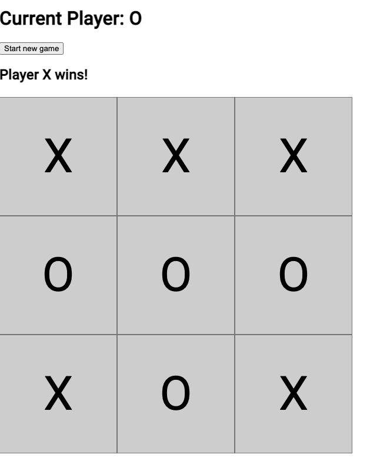
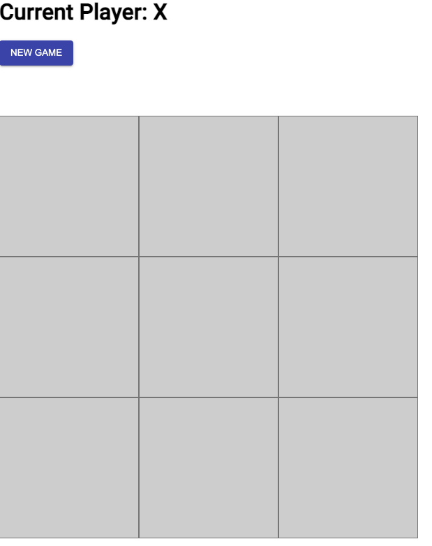
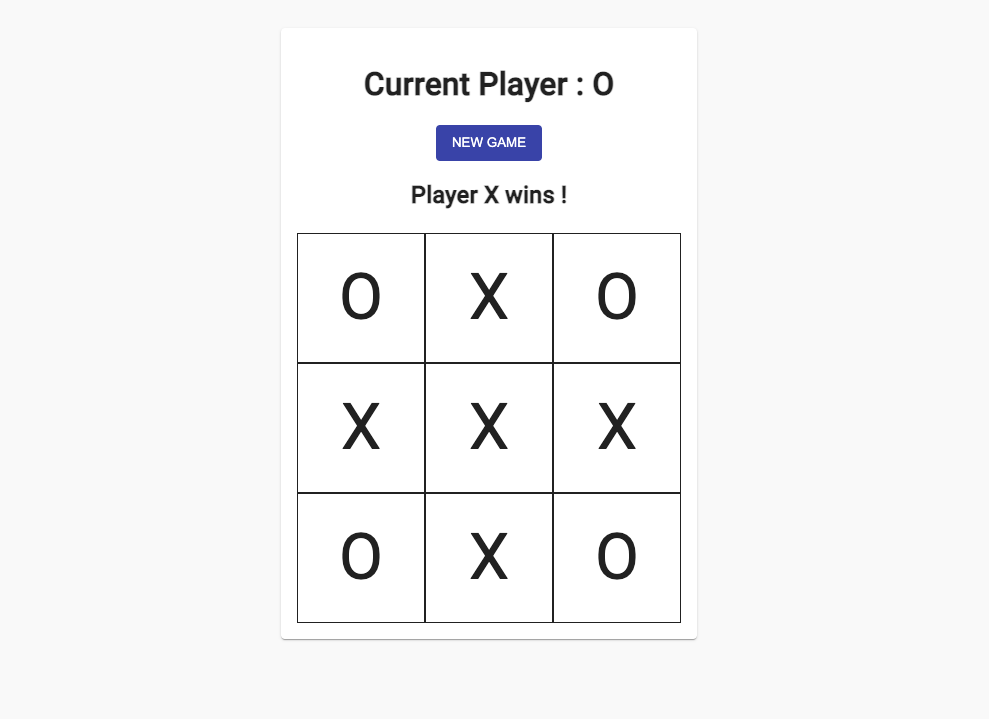
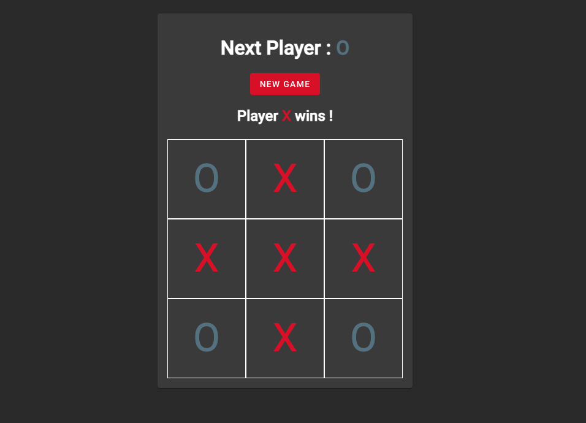
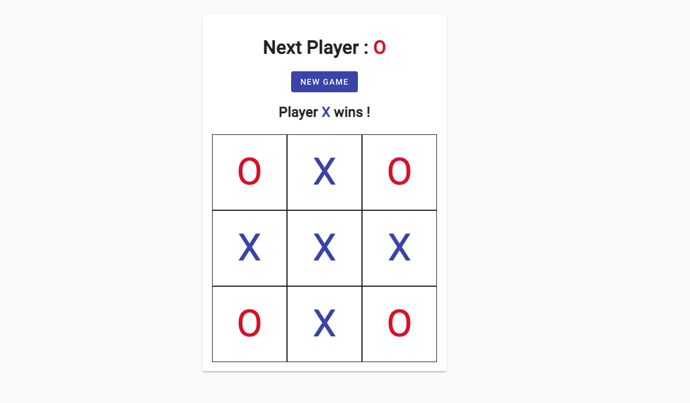

# ng-beginner
Angular 2 (v15) beginner tutorial.

## Introduction
We will build a tic-tac-toe game in this tutorial. The game will have a board of 3x3 squares. Two players will take turns to mark a square with their symbol (either X or O). The player who succeeds in placing three of their marks in a horizontal, vertical, or diagonal row wins the game.

### Install Node.js
Download and install Node.js from [here](https://nodejs.org/en/download/).

### Install Angular CLI
Open a terminal and run the following command to install Angular CLI globally.
```shell
npm install -g angular-cli
```

### Create a new project
Create a new project using the Angular CLI.
```shell
ng new ng-beginner
```
We'll be prompted to answer a few questions. The answers are as follows:
```
? Would you like to add Angular routing? Yes
? Which stylesheet format would you like to use? SCSS   [ https://sass-lang.com/documentation/syntax#scss                ]
```

### If you are using Visual Studio Code
Install extensions :
- Angular language service
- Angular 2 TypeScript Snippets
- Angular console

## Startup the project
Open a terminal and navigate to the project folder. Run the following command to start the project.
```shell
ng serve
```
Open a browser and navigate to http://localhost:4200.

## Application

### Create first component
Create a new component called `square` using the Angular CLI.
```shell
 ng generate component square --inline-template --inline-style
```
or
```shell
 ng g c square -t -s
```
This component will have its HTML template and CSS styles inside.
We will use this component to display a square in the board.

A neq folder called `square` will be created in the `src/app` folder. The following files will be created:
- `square.component.css`
- `square.component.html`

```
app
├── app-routing.module.ts
├── app.component.html
├── app.component.scss
├── app.component.spec.ts
├── app.component.ts
├── app.module.ts
└── square
    ├── square.component.spec.ts
    └── square.component.ts
```

Add the component in the app component template.
```html
<app-square></app-square>
<router-outlet></router-outlet>
```

Just as an example, we could display a random number in the square component,
updated every second.
```typescript
import { Component } from '@angular/core';
@Component({
  selector: 'app-square',
  template: `
    <p>
      {{ random }}
    </p>
  `,
  styles: [
  ]
})
export class SquareComponent {
  random = Math.random();

  constructor() {
    setInterval(() => {
      this.random = Math.random();
    }, 1000);
  }
}
```

### Pass data to a component
We want to pass the value of the square to the square component. 
We will use the `@Input` decorator to do that.

`square.component.ts`
```typescript
import { Component, Input } from '@angular/core';

@Component({
  selector: 'app-square',
  template: `
    <p>
      {{ value }}
    </p>
  `,
  styles: [],
})
export class SquareComponent {
  @Input() value?: 'X' | 'O';
}
```
__Note:__ The `?` after `value` means that the value is optional, so that TypeScript 
won't complain if we don't pass a value to the component.

`app.component.html`
```html
<app-square value='X'></app-square>
<app-square [value]="'O'"></app-square>
<router-outlet></router-outlet>
```
__Note:__ The `[value]` syntax is called property binding.
It is used to bind a property of a component to a value. 

>We just made our first UI (or dumb) component because it doesn't have any logic. 
> Those components are called presentational components. 
> They are used to display data, are easily testable and reusable.

### Create the board component
Create a new component called `board` using the Angular CLI.
```shell
 ng g c board
```
Which will create a new folder called `board` in the `src/app` folder.
```
app/board
├── board.component.html
├── board.component.scss
├── board.component.spec.ts
└── board.component.ts
```
- `board.component.html` is the template of the component.
- `board.component.scss` is the CSS styles of the component.
- `board.component.spec.ts` is the unit test of the component.
- `board.component.ts` is the TypeScript code of the component.

`board.component.ts`
```typescript
import { Component } from '@angular/core';

@Component({
  selector: 'app-board',
  templateUrl: './board.component.html',
  styleUrls: ['./board.component.scss']
})
export class BoardComponent {
  // representation of the nine squares on the board
  squares: any[];
  // help us track whose turn it is
  xIsNext: boolean;
  // will either be 'X', 'O', null or undefined
  winner: string | null | undefined;
}
```
We start by defining the properties of the board component.
- `squares` is an array of nine elements. Each element will be either 'X', 'O' or null.
- `xIsNext` is a boolean that will help us track whose turn it is.
- `winner` will either be `'X'`, `'O'`, `null` or `undefined`
  - If it is `'X'`, it means that X won the game.
  - If it is `'O'`, it means that O won the game.
  - If it is `null`, it means that the game is not finished yet.
  - If it is `undefined`, it means that the game is finished and there is no winner.

We now use the onInit lifecycle hook to initialize the board.
```typescript
import { Component, OnInit } from '@angular/core';

@Component({
  selector: 'app-board',
  templateUrl: './board.component.html',
  styleUrls: ['./board.component.scss']
})
export class BoardComponent implements OnInit {
  // representation of the nine squares on the board
  squares: any[];
  // help us track whose turn it is
  xIsNext: boolean;
  // will either be 'X', 'O', null or undefined
  winner: string | null | undefined;

  ngOnInit() {
    this.newGame();
  }

  // we initialize the game
  //// we set the squares to an array of 9 nulls
  //// we set the winner to null
  //// we set xIsNext to true
  newGame() {
    this.squares = Array(9).fill(null);
    this.winner = null;
    // X is the first player
    this.xIsNext = true;
  }
}
```

We are going to use a javascript getter to identify the player.
```typescript
// identify the current player
get player() {
  return this.xIsNext ? 'X' : 'O';
}
```

We then are going to simulate a move on the board.
```typescript
// simulate a move
makeMove(idx: number) {
  if (!this.squares[idx]) {
    // if the square is falsy, we fill it with the current player
    this.squares.splice(idx, 1, this.player);
    // we switch the player
    this.xIsNext = !this.xIsNext;
  }
}
```

We then check if there is a winner.
```typescript
  makeMove(idx: number) {
    if (!this.squares[idx]) {
      // if the square is falsy, we fill it with the current player
      this.squares.splice(idx, 1, this.player);
      // we switch the player
      this.xIsNext = !this.xIsNext;
    }
    
    // we check if there is a winner
    this.winner = this.calculateWinner();
  }
  
  // check if there is a winner
  // cf React tutorial: https://reactjs.org/tutorial/tutorial.html#declaring-a-winner
  calculateWinner() {
    // we define the winning combinations
    const lines = [
      [0, 1, 2],
      [3, 4, 5],
      [6, 7, 8],
      [0, 3, 6],
      [1, 4, 7],
      [2, 5, 8],
      [0, 4, 8],
      [2, 4, 6],
    ];
    // we loop through the winning combinations
    for (let i = 0; i < lines.length; i++) {
      // we destructure the winning combination
      const [a, b, c] = lines[i];
      // if the squares at the winning combination indexes are all equal and not falsy
      if (
        this.squares[a] &&
        this.squares[a] === this.squares[b] &&
        this.squares[a] === this.squares[c]
      ) {
        // we return the winner
        return this.squares[a];
      }
    }
    // if there is no winner, we return null
    return null;
  }
```

## Now, let's take care of the User Interface

### Create the board template

We first display the current player.
`board.component.html`
```html
<h1>Current Player: {{ player }} </h1>
```
We then display a button to start a new game.
```html
<button (click)="newGame()">Start new game</button>
```
We then display the nine squares.
```html
<main>
    <app-square
            *ngFor="let square of squares; let i = index"
            [value]="square"
            (click)="makeMove(i)">
    </app-square>
</main>
```
- `*ngFor` is a structural directive that loops through the squares array and creates a new square component for each element.
- `[value]="square"` is an attribute directive that passes the value of the square to the square component.
- `(click)="makeMove(i)"` is an event binding that calls the makeMove method when the user clicks on a square.

We want to finally display the winner, if there is one.
```html
<h2>
    <ng-container *ngIf="winner">Player {{ winner }} wins! </ng-container>
</h2>
```
- `*ngIf` is a structural directive that displays the winner if there is one.
- `<ng-container>` is a structural directive that does not create a new DOM element.
- `{{ winner }}` is an interpolation that displays the winner.

The final template looks like this:

`board.component.html`
```html
<h1>Current Player: {{ player }} </h1>

<button (click)="newGame()">Start new game</button>

<h2>
    <ng-container *ngIf="winner">Player {{ winner }} wins! </ng-container>
</h2>

<main>
    <app-square
            *ngFor="let square of squares; let i = index"
            [value]="square"
            (click)="makeMove(i)">
    </app-square>
</main>
```

## We need some styling!

In the file `board.component.scss`, we add the following styles:
```scss
main {
  display: grid;
  grid-template-columns: 200px 200px 200px;
}

h2 {
  height: 2rem;
}

app-square {
  display: flex;
  align-items: center;
  justify-content: center;
  border: 1px solid gray;
  background: lightgray;
  height: 200px;
  font-size: 5em;
}
```
- The display property of the `main` element is set to `grid`. This allows us to display the squares in a grid.
- The `grid-template-columns` property of the main element is set to `200px 200px 200px`. This allows us to display the squares in a 3x3 grid.
- The height property of the `h2` element is set to `2rem`. This allows us to fix the size.
- The display property of the `app-square` element is set to flex. This allows us to display the value of the square in the center of the square.

### Now, our application looks like this:




> hhmmm... not very pretty, is it?

Let's be smart and use a library to make it look better.

## Let's use Angular Material

There are many third party component libraries that we can use to make our application look better like Bootstrap, Ionic, Nebular, etc. But we are going to use Angular Material.

### Install Angular Material

We are going to use the Angular CLI to install Angular Material.
```shell
ng add @angular/material
```
The CLI will ask us a few questions:
- Choose a prebuilt theme name, or "custom" for a custom theme: `Custom`
- Set up Global Angular Material typography styles? `Yes`
- Include the Angular animations module? `Do not include`
```shell
? Choose a prebuilt theme name, or "custom" for a custom theme: Custom
? Set up global Angular Material typography styles? Yes
? Include the Angular animations module? Do not include
UPDATE package.json (1108 bytes)
✔ Packages installed successfully.
UPDATE src/styles.scss (1644 bytes)
UPDATE src/index.html (578 bytes)
```
The CLI updated the `package.json` file, the `src/styles.scss` file and the `src/index.html` file.

Let's see the changes in the UI.



Not much has changed aside from the font and the margin.

### Let's checkout the generated code

`src/styles.scss`
```scss

// Custom Theming for Angular Material
// For more information: https://material.angular.io/guide/theming
@use '@angular/material' as mat;
// Plus imports for other components in your app.

// Include the common styles for Angular Material. We include this here so that you only
// have to load a single css file for Angular Material in your app.
// Be sure that you only ever include this mixin once!
@include mat.core();

// Define the palettes for your theme using the Material Design palettes available in palette.scss
// (imported above). For each palette, you can optionally specify a default, lighter, and darker
// hue. Available color palettes: https://material.io/design/color/
$ng-beginner-primary: mat.define-palette(mat.$indigo-palette);
$ng-beginner-accent: mat.define-palette(mat.$pink-palette, A200, A100, A400);

// The warn palette is optional (defaults to red).
$ng-beginner-warn: mat.define-palette(mat.$red-palette);

// Create the theme object. A theme consists of configurations for individual
// theming systems such as "color" or "typography".
$ng-beginner-theme: mat.define-light-theme((
  color: (
    primary: $ng-beginner-primary,
    accent: $ng-beginner-accent,
    warn: $ng-beginner-warn,
  )
));

// Include theme styles for core and each component used in your app.
// Alternatively, you can import and @include the theme mixins for each component
// that you are using.
@include mat.all-component-themes($ng-beginner-theme);

/* You can add global styles to this file, and also import other style files */

html, body { height: 100%; }
body { margin: 0; font-family: Roboto, "Helvetica Neue", sans-serif; }
```

The following only has impact for now:
- The `html` and `body` elements have a height of 100%.
- The `body` element has a margin of 0.
- The `body` element has a font-family of Roboto.

We can see that a lot was added in terms of theming but by default not much will change unless
we use material components and classes.

As for the `src/index.html` file, the following was added:
```html
<!doctype html>
<html lang="en">
<head>
  <meta charset="utf-8">
  <title>NgBeginner</title>
  <base href="/">
  <meta name="viewport" content="width=device-width, initial-scale=1">
  <link rel="icon" type="image/x-icon" href="favicon.ico">
  <link rel="preconnect" href="https://fonts.gstatic.com">
  <link href="https://fonts.googleapis.com/css2?family=Roboto:wght@300;400;500&display=swap" rel="stylesheet">
  <link href="https://fonts.googleapis.com/icon?family=Material+Icons" rel="stylesheet">
</head>
<body class="mat-typography">
  <app-root></app-root>
</body>
</html>
```

It added the following:
- The `link` element with the `href` attribute set to `https://fonts.googleapis.com/css2?family=Roboto:wght@300;400;500&display=swap` was added. This allows us to use the Roboto font.
- The `link` element with the `href` attribute set to `https://fonts.googleapis.com/icon?family=Material+Icons` was added. This allows us to use the Material Icons.
- The `body` element has the `mat-typography` class. This allows us to use the typography styles of Angular Material.

## Now it's time to make it pretty!

### The button

Let's start with the button.

First, we need to import the `MatButtonModule` in the `app.module.ts` file.
```typescript
import {MatButtonModule} from '@angular/material/button';

@NgModule({
  declarations: [
    AppComponent,
    SquareComponent,
    BoardComponent
  ],
  imports: [
    BrowserModule,
    AppRoutingModule,
    MatButtonModule
  ],
  providers: [],
  bootstrap: [AppComponent]
})
export class AppModule { }
```

Then, we can use the `mat-raised-button` directive in the `board.component.html` file 
and color it with the `color` attribute.

```html
<h1>Current Player: {{ player }} </h1>

<button mat-raised-button color="primary" (click)="newGame()">NEW GAME</button>

<h2>
    <ng-container *ngIf="winner">Player {{ winner }} wins! </ng-container>
</h2>

<main>
    <app-square
            *ngFor="let square of squares; let i = index"
            [value]="square"
            (click)="makeMove(i)">
    </app-square>
</main>
```

Let's take a look at the UI.



> Cool button, right?

### Next Level

We are going to use the `MatCardModule` to make the board look better.
```html
<mat-card>
    <mat-card-header>
        <h1>Current Player : {{ player }} </h1>
    </mat-card-header>
    <mat-card-content>
        <button mat-flat-button color="primary" (click)="newGame()">
            NEW GAME
        </button>

        <h2>
            <ng-container *ngIf="winner">Player {{ winner }} wins ! </ng-container>
        </h2>

        <main>
            <app-square
                    *ngFor="let square of squares; let i = index"
                    [value]="square"
                    (click)="makeMove(i)">
            </app-square>
        </main>
    </mat-card-content>
</mat-card>
```

And modify the `board.component.scss` file to clean, center it and make it responsive.
```scss
$square-size: 8rem;

:host {
  display: flex;
  justify-content: center;
}

mat-card {
  display: flex;
  text-align: center;
  flex-direction: column;
  align-items: center;
  margin-top: 2em;
}

main {
  display: grid;
  grid-template-columns: $square-size $square-size $square-size;
}

h2 {
  height: 2rem;
}

app-square {
  display: flex;
  align-items: center;
  justify-content: center;
  border: 1px solid;
  height: $square-size;
}
```
Some explanations:
- The `$square-size` variable is used to define the dimensions of the grid.
- For the grid, we changed the unit to `rem` to make it responsive.
- The `:host` selector is used to select the host element of the component. In this case, it is the `board.component.html` file.
- We use `display: flex` and `justify-content: center` to center the `mat-card` element.
- Inside the `mat-card` element, we use `display: flex`, `text-align: center`, `flex-direction: column` and `align-items: center` to center the content.

Also tweaked the `square.component.ts` file to be responsible for the font-size and change
the cursor on hover.
```typescript
import { Component, Input } from '@angular/core';

@Component({
  selector: 'app-square',
  template: `
      {{ value }}
  `,
  styles: [`
    :host {
      font-size: 4rem;
      &:hover {
        cursor: pointer;
      }
    }
  `],
})
export class SquareComponent {
  @Input() value?: 'X' | 'O';
}
```

>AND Voilà!



### Going further in theming

I want to make improvement in theming:
- Define my custom palette
- Handle dark / light mode depending on the user's system preferences

After a few changes it looks like this on my System :



> Definitely better!

Plus, if I were to change my system preferences to light, the theme would change automatically.
You wouldn't even need to refresh the page.




I won't go into implementation details since it is not that complicated and I created
a Pull Request intentionally, so you can check the code diff:
- [PR](https://github.com/gaetanBloch/ng-beginner/pull/1)
- [Diff](https://github.com/gaetanBloch/ng-beginner/pull/1/files)

## Pipes

I just noticed in my code that I was repeating the same logic in the same or different templates.

In `square.component.html`
```html
<h1>
    Next Player :
    <b [class]="player === 'X' ? 'primary' : 'accent'">{{ player }}</b>
</h1>
...
<ng-container *ngIf="winner">
    Player
    <b [class]="winner === 'X' ? 'primary' : 'accent'">{{ winner }}</b>
    wins !
</ng-container>
```
And in `board.component.ts`
```typescript
template: `
    <span [class]="value === 'X' ? 'primary' : 'accent'" >
      {{ value }}
    </span>
  `,
```
If you were to re-use some code in the same template, then it's easy, 
you can create a function in the component and call it in the template.

> What if you want to re-use some code in different templates?

That's where the pipes come in.
Pipes are a way to transform data in the template. There are pre-defined pipes in Angular, for 
example, the `uppercase` pipe.
```html
{{ 'hello' | uppercase }}
```
See https://angular.io/guide/pipes for more information.

Here, we need to create a custom pipe. Let's create a `getClass` pipe that will return the class
depending on the player.

You can generate a pipe with the Angular CLI:
```shell
ng generate pipe pipes/getClass
```
Angular will generate a file `getClass.pipe.ts` in the `src/app/pipes` folder.
```typescript
import { Pipe, PipeTransform } from '@angular/core';

@Pipe({
  name: 'getClass'
})
export class GetClassPipe implements PipeTransform {

  transform(value: unknown, ...args: unknown[]): unknown {
    return null;
  }

}
```
Let's modify it to fit our needs.
```typescript
import { Pipe, PipeTransform } from '@angular/core';
@Pipe({
  name: 'getClass'
})
export class GetClassPipe implements PipeTransform {
  transform(player: 'X' | 'O' | undefined | null): string {
    return player === 'X' ? 'primary' : 'accent';
  }
}
```
Then we can use it in our templates.
```html
<h1>
    Next Player :
    <b class="{{ player | getClass }}">{{ player }}</b>
</h1>
<ng-container *ngIf="winner">
    Player
    <b class="{{ winner | getClass }}">{{ winner }}</b>
    wins !
</ng-container>
```
```html
  template: `
    <span class="{{ value | getClass }}" >
      {{ value }}
    </span>
  `,
```
That's it!

# Inspired by
- https://beta.reactjs.org/learn/tutorial-tic-tac-toe
- https://fireship.io/courses/angular
